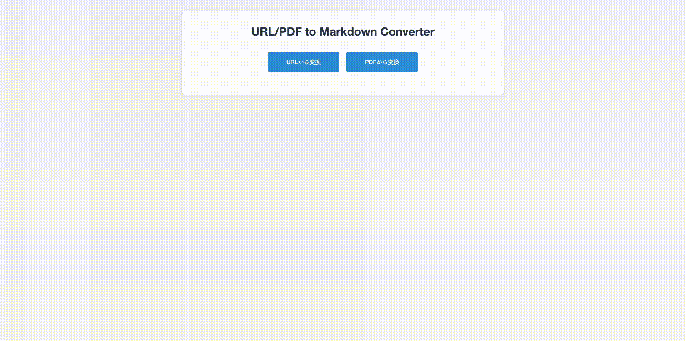

# URL/PDF to Markdown Converter

URL/PDF to Markdown Converterは、ウェブページのURLやPDFファイルからマークダウン形式のテキストを生成するシンプルなWebアプリケーションです。

## デモ



## 機能

- ウェブページURLの入力からMarkdownへの変換
- PDFファイルのアップロードからMarkdownへの変換
- 生成されたMarkdownのコピーとダウンロード機能


## 技術スタック

- **バックエンド**: Go言語（Gin Webフレームワーク）
- **フロントエンド**: HTML, CSS, JavaScript
- **PDF処理**: poppler-utils (pdftotext)
- **HTML解析**: goquery
- **HTML→Markdown変換**: html-to-markdown
- **コンテナ化**: Docker, Docker Compose

## 使用方法

### Dockerを使用した実行

1. このリポジトリをクローン
   ```bash
   git clone https://github.com/NabeRoute/URL-PDF_to_Markdown_Converter.git
   cd url-to-markdown-converter
   ```

2. Docker Composeでビルド＆実行
   ```bash
   docker-compose up --build
   ```

3. ブラウザで開く
   ```
   http://localhost:8080
   ```

### ローカル環境での実行

1. Go 1.16以上をインストール

2. 依存関係のインストール
   ```bash
   go mod download
   ```

3. アプリケーションを実行
   ```bash
   go run main.go
   ```

4. ブラウザで開く
   ```
   http://localhost:8080

   ```


